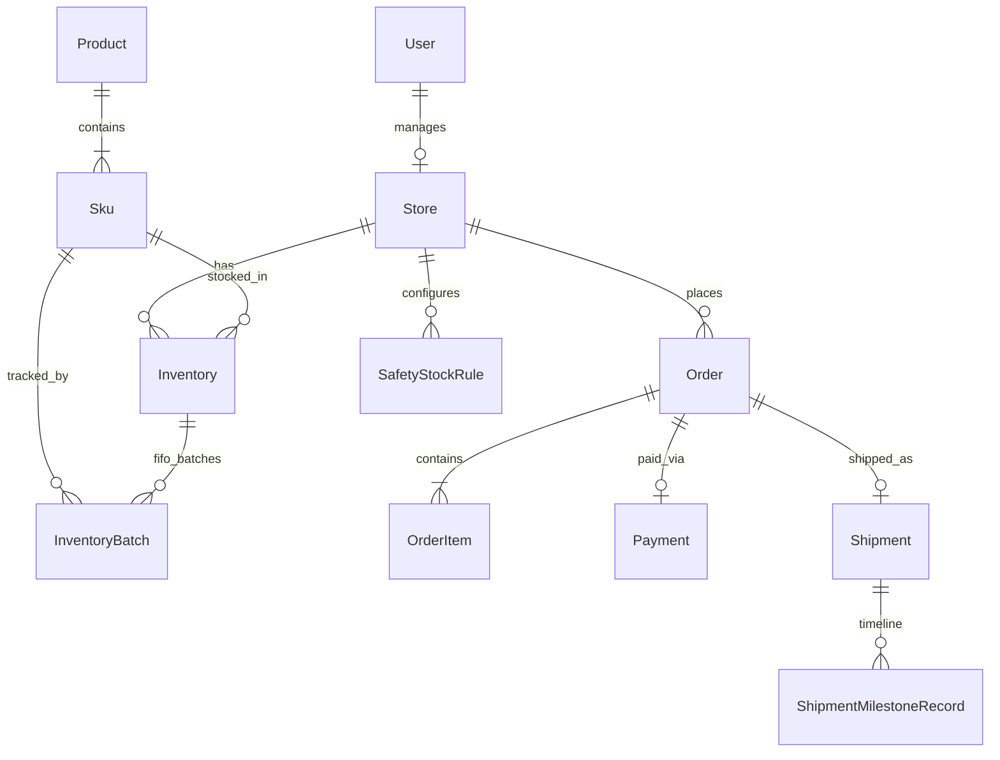

# HAVENPET Database Schema

PostgreSQL schema managed by Prisma (`backend/prisma/schema.prisma`).

## Entity Relationship Overview



## Core Tables

| Model | Purpose |
|-------|---------|
| `User` | JWT auth; roles `hq_admin` \| `store_manager` |
| `Store` | Overseas location, currency, tax/duty rates |
| `Product` | Parent catalog entry (USD/RMB base pricing) |
| `Sku` | Variant attributes: flavour, weight, barcode |
| `Inventory` | Stock per warehouse (`hq_central` \| `store_retail`) |
| `InventoryBatch` | Batch number + expiry for FIFO |
| `SafetyStockRule` | Low-stock threshold + suggested reorder qty |
| `Order` | B2B restock orders with full pricing snapshot |
| `OrderItem` | Line items with SKU snapshot JSON |
| `Payment` | Card, wire (receipt), Stripe, PayPal |
| `Shipment` | Carrier, tracking, container, customs notes |
| `ShipmentMilestoneRecord` | Visual logistics timeline events |
| `ExchangeRate` | Multi-currency conversion cache |
| `StoreSaleRecord` | Retail sales for analytics (Step 5) |

## Order State Machine

```
draft → pending_payment → paid_awaiting_shipment → shipped_in_transit
  → customs_clearance → arrived_at_store → completed
  (or refunded / cancelled at any payable stage)
```

## Inventory Design

- **HQ Central:** `warehouseType = hq_central`, `storeId = null`
- **Store Retail:** `warehouseType = store_retail`, `storeId` set
- **FIFO:** Query `InventoryBatch` ordered by `expiryDate ASC`
- **Low stock:** Compare `Inventory.quantity` vs `SafetyStockRule.safetyThreshold`

## RBAC

| Route pattern | `hq_admin` | `store_manager` |
|---------------|------------|-----------------|
| `/auth/register` | ✓ | ✗ |
| HQ modules (Step 2+) | ✓ | ✗ |
| Store dashboard (Step 3+) | ✗ | ✓ (own `storeId` only) |

## Indexes

Unique constraints on store codes, SKU variant codes, order numbers, and composite inventory keys (`skuId + warehouseType + storeId`).
