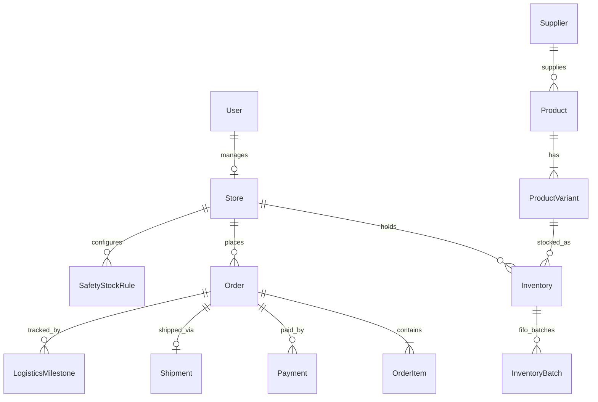

# HAVENPET Database Schema

PostgreSQL via Prisma. Source of truth: `backend/prisma/schema.prisma`.

## Entity relationship overview

## Core tables

| Table | Purpose |
|-------|---------|
| `users` | JWT auth; roles `hq_admin`, `store_manager` |
| `stores` | Overseas locations, currency, tax/duty rates |
| `products` / `product_variants` | Catalog & SKU attributes (flavour, weight) |
| `inventories` | Stock per location (`hq_central` vs `store_retail`) |
| `inventory_batches` | Batch number, expiry, FIFO `quantity_remaining` |
| `safety_stock_rules` | Low-stock thresholds → restock alerts |
| `orders` / `order_items` | B2B restock orders with multi-currency totals |
| `payments` | Card, wire (HQ approval), Stripe, PayPal |
| `shipments` | Carrier, tracking, container, customs notes |
| `logistics_milestones` | Timeline events for store tracking UI |
| `exchange_rates` | Cached FX for checkout conversion |
| `retail_sales` | In-store POS data for analytics (Step 5) |

## Inventory locations

- **HQ central:** `warehouse_type = hq_central`, `store_id` = HQ-HUB system store
- **Store retail:** `warehouse_type = store_retail`, `store_id` = overseas store

## Order status workflow

`draft` → `pending_payment` → `paid_awaiting_shipment` → `shipped_in_transit` → `customs_clearance` → `arrived_at_store` → `completed`

Terminal: `cancelled`, `refunded`

## Seed data

Run `npx prisma db seed` after migrate. Demo accounts use password `Havenpet123!`.
